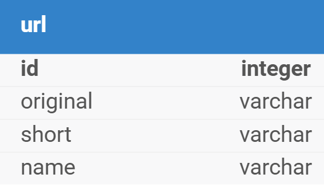
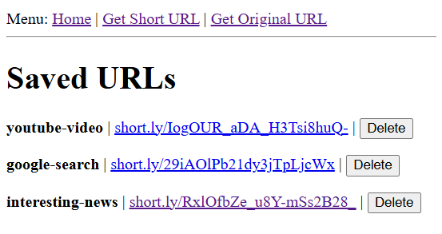
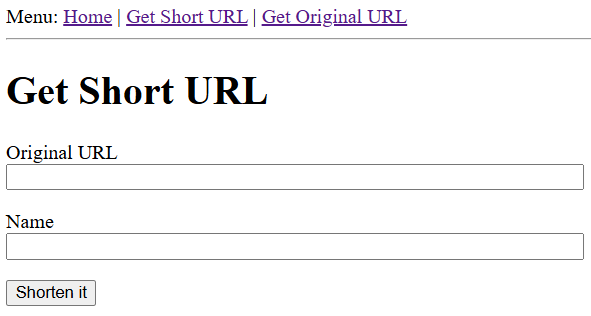
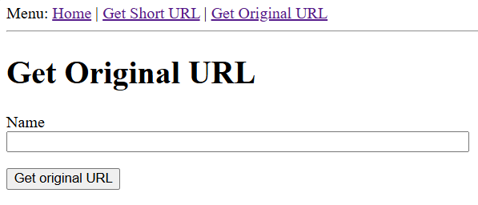

# URL Shortener Application

Author: Caroline Lopes dos Santos

## Contents

| Content | Description | Path | 
| ---- | ---- | ---- |
| General overview | Explanation about the application's architecture | This README file |
| How to run | Instructions for how to configure the application both locally and on the cloud | This README file |
| Application | Simple application with Flask framework (I decided to challenge myself and this is my first Flask application). Encapsulates both a simple frontend and an API. | `flask_app/` | 
| Baseline IaC | Creates Terraform state S3 bucket, DynamoDB lock table and Terraform service roles | `ìnfrastructure/terraform/baselines/` |
| Main IaC | Creates EKS and associated resources | `ìnfrastructure/terraform/main/` |
| Terraform custom modules | 2 modules for baseline configurations, 1 module for WAFv2 (other community modules are used throughout the code) | `infrastructure/terraform/_modules` |
| Kubernetes manifests | Manifests needed to deploy the application on the EKS cluster | `infrastructure/manifests/` |
| Images | The images used throughout this README file | `images/` |
| Next steps | Suggestions of improvement and next steps to optimize even further the application | This README file |

## 1. How to use

### 1.1 Local application without containers

#### 1.1.1 Pre-requisites

- Linux OS (tested on Ubuntu)
- Have installed the following packages:

```bash
postgresql
libpq-dev
python3.12-dev

# E.g. to install:
sudo apt install libpq-dev postgresql python3.12-dev
```

- Python version 3.12.7 or greater
- Pip version 24.2 or greater
- Have activated a virtual environment inside `flask_app` and installed the application requirements. See commands below for reference:

```bash
cd flask_app
python3 -m venv venv
pip install -r requirements.txt
```

- Guarantee that local PostgreSQL service is runnning:

```bash
sudo service postgresql start
```

##### 1.1.2 Initializing the database

Still in `flask_app` directory, run:

```bash
flask db init
flask createdb
flask db migrate -m "url table"
flask db upgrade
```

##### 1.1.3 Configuring environment variables

Copy the `.env.template` file to a new one called `.env` and add the needed values. To generate a secret key, you can run:

```bash
python3 -c "import uuid; print(uuid.uuid4().hex)"
```

Remember to use `DB_HOST=localhost`.

#### 1.1.4 Run the application

Still in `flask_app` directory, run: `flask run`.

The application should now be available in `http://localhost:5000/`.

#### 1.1.5 Stopping the application

You can type `ctrl+C` on the same terminal used to launch the application.

### 1.2 Local application with containers

#### 1.2.1 Pre-requisites

- Linux OS (tested on Ubuntu)
- Have installed Docker and Docker compose command line tools
- Guarantee that local PostgreSQL service is NOT runnning:

```bash
sudo service postgresql stop
```

#### 1.2.2 Configuring environment

Copy the `.env.template` file to a new one called `.env` and add the needed values. To generate a secret key, you can run:

```bash
python3 -c "import uuid; print(uuid.uuid4().hex)"
```

Remember to use `DB_HOST=postgres` (not `localhost` anymore).

#### 1.2.3 Running the application 

Still in `flask_app` directory, run: `docker compose up --build`.

Initializing errors for the application are expected while the database is finishing its configuration. Just wait for retries in a couple seconds and it should be fine.

The application should now be available in `http://localhost:5000/`.


#### 1.2.5 Stopping the application

You can type `ctrl+C` on the same terminal used to launch the application. Then run `docker compose down`.


### 1.3 Running the application in AWS

#### 1.3.1 Pre-requisites

- Have a Terraform version manager installed (suggestion: https://github.com/tofuutils/tenv) in order to compy with `versions.tf` required Terraform version.
- Have installed AWS CLI, [eksctl](https://docs.aws.amazon.com/pt_br/eks/latest/userguide/getting-started-eksctl.html) and [kubectl version 1.30](https://kubernetes.io/pt-br/docs/reference/kubectl/).
- SSO into a role with Administrative permissions (for POC only, not good practice).

#### 1.3.2 Apply Baselines IaC

Go to `infrastructure/terraform/baselines` directory.

Update the AWS account ID when needed in the code. In this case, these are the files referencing a hardcoded account ID:

- `var/shortly/dev.tfvars`

Also, update the default values of the following variables if needed:

- `iac_source`
- `owner`

On `infrastructure/terraform/baselines/readme.md`, follow the instructions to apply the IaC code. 

At the end, you should have created an S3 bucket, a DynamoDB lock table and two new Terraform service roles.

#### 1.3.3 Configure a the .auto.tfvars file

Go to `infrastructure/terraform/main` directory.

Copy `default.auto.tfvars.template` to a new file called `default.auto.tfvars`. Update the content with your public IP. You can check it here: https://checkip.amazonaws.com.

#### 1.3.4 Apply Main IaC

In `infrastructure/terraform/main` directory, update the AWS account ID when needed in the code. In this case, these are the files referencing a hardcoded account ID:

- `var/dev.tfvars`
- `env/dev.s3.tfbackend`

Also, update the default values of the following variables if needed:

- `iac_source`
- `owner`
- `domain_name`

On `infrastructure/terraform/main/readme.md`, follow the instructions to apply the IaC code. 

At the end, you should have created the EKS cluster and all the associated resources.

#### 1.3.5 Request a new certificate from AWS ACM

Go to [AWS ACM service](https://us-east-1.console.aws.amazon.com/acm/home?region=us-east-1#) and request a new certificate informing your custom domain. Then, confirm the ownership via DNS, email or with Route53. The goal is to have a valid certificate in order to enable TLS in Loadbalancer.

Finally, update the certificate ID in `infrastructure/manifests/ingress.yaml`, on the line `metadata.annotations.alb.ingress.kubernetes.io/certificate-arn` and the domain name in `spec.rules[0].host`.

OBS: For POC purposes, this is not being managed by Terraform, but a code reference was left in `infrastructure/terraform/main/acm.tf`.

#### 1.3.6 Apply the Kubernetes manifests on the cluster

First, make sure you are still authenticated with the `AWSReservedSSO_AdministratorAccess_*`:

```bash
aws sts get-caller-identity --region us-east-1
```

If not, authenticate with it again via SSO. Now, assume the cluster manager role locally running:

```bash
aws sts assume-role --role-arn arn:aws:iam:::role/dev-<owner-you-configured>-eks-admin \
  --role-session-name admin \
  --profile admin
```

Update cluster context:

```bash
aws eks update-kubeconfig --region us-east-1 --name dev-<owner-you-configured>
```

In `infrastructure/manifests/` directory, run: `kubectl apply -f .`.

After some moments check for the pods health either with `kubectl get pods --namespace myapp` or in AWS loadbalancer target group health status.


#### 1.3.7 Configuring WAF to keep aplication private

> [!NOTE]
> If you don't need your application to be private, you can skip this step. But remember that the application and the cluster are not yet fully optimized for production (see "Next steps" section at the end), so it is a good practice to keep it private for now.

After the loadbalancer is created, copy its ARN, go to `infrastructure/terraform/main/waf.tf`, uncomment the code and update the loadbalancer ARN value.

Then, repeat the steps in `infrastructure/terraform/main/readme.md` to make a Terraform apply.

After the WAF gets created, remember to copy its ARN and update the value in `infrastructure/manifests/ingress.yaml`, uncommenting the line `metada.annotations.alb.ingress.kubernetes.io/wafv2-acl-arn`. Then run `kubectl apply -f ingress.yaml`.

By now you should have a private application accessible on your custom domain only by the CIDRS you have whitelisted in `default.auto.tfvars`.

## 2. API General overview

The API was developed using [Flask](https://flask.palletsprojects.com/en/stable/) framework, [PostgreSQL](https://www.postgresql.org/) for data persistence, and [SQLAlchemy](https://www.sqlalchemy.org/) as ORM.

The database structure consists on a single table for URLs as shown below:



The following endpoints were configured for the REST API:

- **POST** `/shorten`: Creates a new shortened URL. The request body must contain the source URL and an identifier (name). The response returns the shortened URL.
- **GET** `/shorten`: List all created URLs.
- **DELETE** `/shorten/<string:id>`: Remove a specific shortened URL by identifier.
- **GET** `/convert/<string:id>`: Return the original URL from the shortened URL identifier.
- **GET** `/healthcheck`: Returns 200 status code if the application and database connection are healthy.

Additionally, some routes that return HTML were configured to provide a simple application frontend:

- **GET** `/` and **GET** `/view/index/`: List all saved URLs with their names and clickable short versions. Also displays a delete button next to each save URL.



- **GET** `/view/convert`: Allows the user to submit a long URL with an identifier to obtain a shortened URL in return. Saves it on the database.



- **GET** `/view/consult`: Allows the user to consult the original URL based on the identifier associated with a shortened URL.



The API architecture aims a balance between simplicity and best practices for API design. Some comments on that:

- Error handling middlewares and interceptors were configured both for REST API routes (`app/blueprints/main/api/errors/`) and for views endpoints (`app/blueprints/errors/`).
- There are services and repositories (`app/blueprints/main/services.py`), and for simplicity they are shared between view endpoints and the API routes. 
- The view endpoints do not directly call for the API routes, but for the services. This was to avoid the need to split it in two applications. As said before, this is a simple frontend, added for users convenience only, it is not yet optimized for production. See "Next steps" section at the end.
- Controllers and routes are in the same files for simplicity as well (`**/routes.py`).
- An ORM was used to improve management of migrations and other database operations. Database configuration was made in `app/extensions` since these are external modules to the application.
- Models (`app/models/`) and views templates (`app/templates/`) are also present in the architecture.


## 3. Next steps

- Separate frontend from API, currently in the same package. Host frontend in a cloud native way, i.e. host its static files in a private S3 bucket, then add Cloudfront, Route53 and WAFv2 configurations.
- Add unit tests to the API.
- Improve the API layers separation/organization, i.e. the controllers, routes, services, repositories, models, middlewares, interceptors.
- On the cluster, add cluster autoscaler configuration, either with native Kubernetes autoscaler or with AWS Karpenter.
- Parametrize manifests for flexibility across environments using HelmCharts.
- Configure secrets instead of plain ConfigMaps for the sensitive database variables.
- Move database to outside the cluster but keep it in a cloud native configuration, i.e. create a PostgreSQL RDS Cluster and update the application environment variables with these new credentials.
- Configure encryption at rest on the cluster.
- Configure a GitHub Actions workflow to build the application Docker image, save it in ECR and update tag value in manifests.
- Implement a GitOps strategy for the application CI/CD using tools like ArgoCD, GitHub Actions or Jenkins.
- Automate Terraform operations with GitHub Actions pipelines.
- Add observability to the cluster with tools like Prometheus, Grafana.

> [!NOTE]
> Most of these steps I have done before in other projects, it was just not possible now due to time constraints. Feel free to ask me about these other projects and experiences.